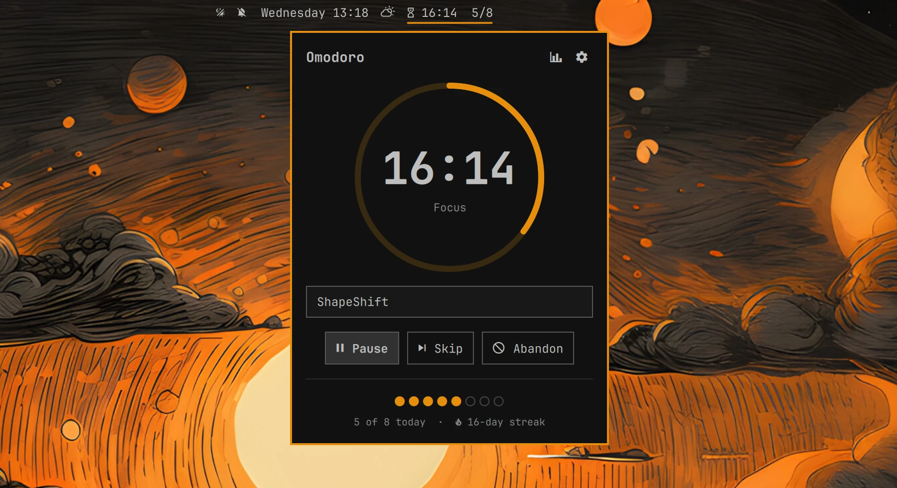
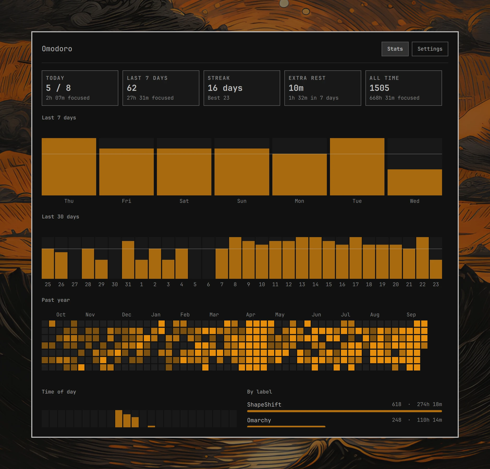

# Omodoro

A Pomodoro timer for the Omarchy bar.

<p align="center">
  
</p>

The bar chip shows the live countdown: focus, break, paused, or overtime,
plus today's progress against your daily goal (`󰔟 18:42  3/8`). Click it for
a minimal timer panel with a progress ring, start/pause, skip, abandon, a
label for what you're working on, and today's goal dots. Stats and settings
live in their own window, opened from the two icons at the top of the panel.

- **Focus and breaks.** 25-minute focus sessions by default, a short break
  after each, and a long break after every fourth. All lengths are
  configurable. Nothing starts on its own: each phase waits for you.
- **Daily goal and streaks.** Today's pomodoros against a goal, and a streak
  of consecutive days that met it.
- **Strict mode.** Once focus starts, you can't pause or skip it. Abandoning
  still works, after a confirm, and is recorded as abandoned.
- **Overtime.** When focus hits zero the chime plays and the timer keeps
  counting up until you finish it. The extra time is recorded. A forgotten
  session stops counting after an hour.
- **Extra rest.** Breaks always count past zero. Starting the next focus
  (or skipping) ends the break and records how far it ran over. Stats show
  extra rest for today and the last 7 days.
- **Breathing lead-in.** Optional, off by default. Starting focus first
  plays a guided breath (4 s in, 2 s hold, 4 s out) over the whole screen,
  then the timer starts. Space starts right away; Esc cancels.
- **Do Not Disturb.** Turned on for focus and turned back off afterwards,
  unless it was already on before.
- **Stats.** Last 7 and 30 days, a year heatmap, focus by time of day, and
  focus by label.

<p align="center">
  
</p>

More in [`screenshots/`](screenshots): [bar chip](screenshots/bar.webp),
[long break](screenshots/panel-break.webp),
[extra rest](screenshots/panel-extra-rest.webp),
[time of day and labels](screenshots/stats-history.webp), and
[settings](screenshots/settings.webp).

## History and sync

Every finished, skipped, or abandoned phase is appended as one JSON line to
`<dataDir>/sessions-<hostname>.jsonl`. Each machine writes only its own
file and reads everyone's, deduplicating by record id. Point `dataDir` at a
Dropbox folder and history syncs between machines and is backed up, with no
conflicted copies, because no two machines ever write the same file.

**Settings → History** can move the existing files to a new folder, and
**Export JSON + CSV** writes a merged snapshot to `<dataDir>/exports/`.

The running timer itself (`~/.local/state/md.omodoro/timer.json`) stays
local. It stores end times rather than counting ticks, so the timer
survives plugin reloads, shell restarts, and suspend.

## Requirements

- Omarchy 4 (`schemaVersion: 1` plugin API)
- `notify-send` and `pw-play`, both part of a stock Omarchy install

## Install

```bash
omarchy plugin add https://github.com/0xApotheosis/omarchy-omodoro.git --enable
omarchy bar move md.omodoro --section center
```

## Settings

All settings are inline on the widget's entry in `~/.config/omarchy/shell.json`,
and editable in the Settings tab.

| Key | Default | Meaning |
|---|---|---|
| `focusMinutes` | `25` | focus length |
| `shortBreakMinutes` | `5` | short break length |
| `longBreakMinutes` | `15` | long break length |
| `longBreakEvery` | `4` | pomodoros per long break |
| `dailyGoal` | `8` | pomodoros per day for the goal and streak |
| `strictMode` | `false` | no pause or skip during focus |
| `overtime` | `false` | count past zero until focus is finished |
| `breathe` | `false` | guided breath before each focus session |
| `breaths` | `1` | breaths in the lead-in, 1 to 5 |
| `dnd` | `true` | Do Not Disturb while focusing |
| `sound` | `true` | chime at the end of each phase |
| `soundFile` | freedesktop `complete.oga` | chime sound |
| `dataDir` | `~/.local/share/md.omodoro` | history folder, e.g. `~/Dropbox/Omarchy/omodoro` |
| `barMode` | `countdown+goal` | `countdown` or `countdown+goal` |

## Mouse, keyboard, and IPC

In the bar, left click opens the panel, middle click starts or pauses, and
right click skips.

In the panel, `space` starts, pauses, resumes, finishes overtime, or ends
extra rest and starts focus, `s`
skips, `a` abandons (press twice), `e` edits the label, `t` opens stats,
`,` opens settings, `esc` closes, and `tab` moves to the next bar panel.
In the window, `1` and `2` switch tabs.

```bash
omarchy-shell md.omodoro toggle          # start / pause / resume / finish overtime
omarchy-shell md.omodoro skip
omarchy-shell md.omodoro abandon
omarchy-shell md.omodoro setLabel "writing"
omarchy-shell md.omodoro status          # one-line summary
omarchy-shell md.omodoro stats           # open the stats window
omarchy-shell md.omodoro settings
omarchy-shell md.omodoro exportHistory
```

These work well bound to Hyprland keys, for example in `~/.config/hypr/bindings.lua`.
